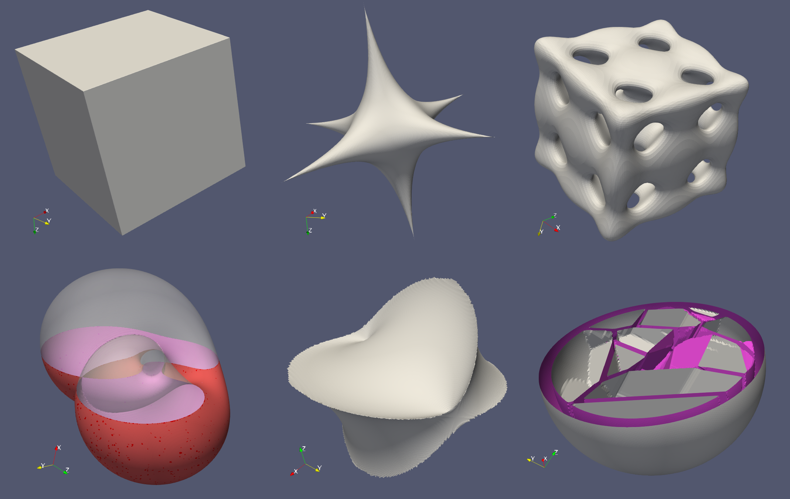

# Minimal marching cubes tessellation
Uses [my geometry library](https://github.com/salvipeter/libgeom/) for handling points/vectors and meshes.

## Installation
Build using CMake.

The ugly table of 256 cases was generated by the Scheme program `gentable.scm`. If any changes are made to it, run `gentable.sh` (requires Gambit Scheme or Guile).

## Usage
There is a single function documented in the header file.
See also the example program in `mc-test.cc`, which generates the objects shown below.

